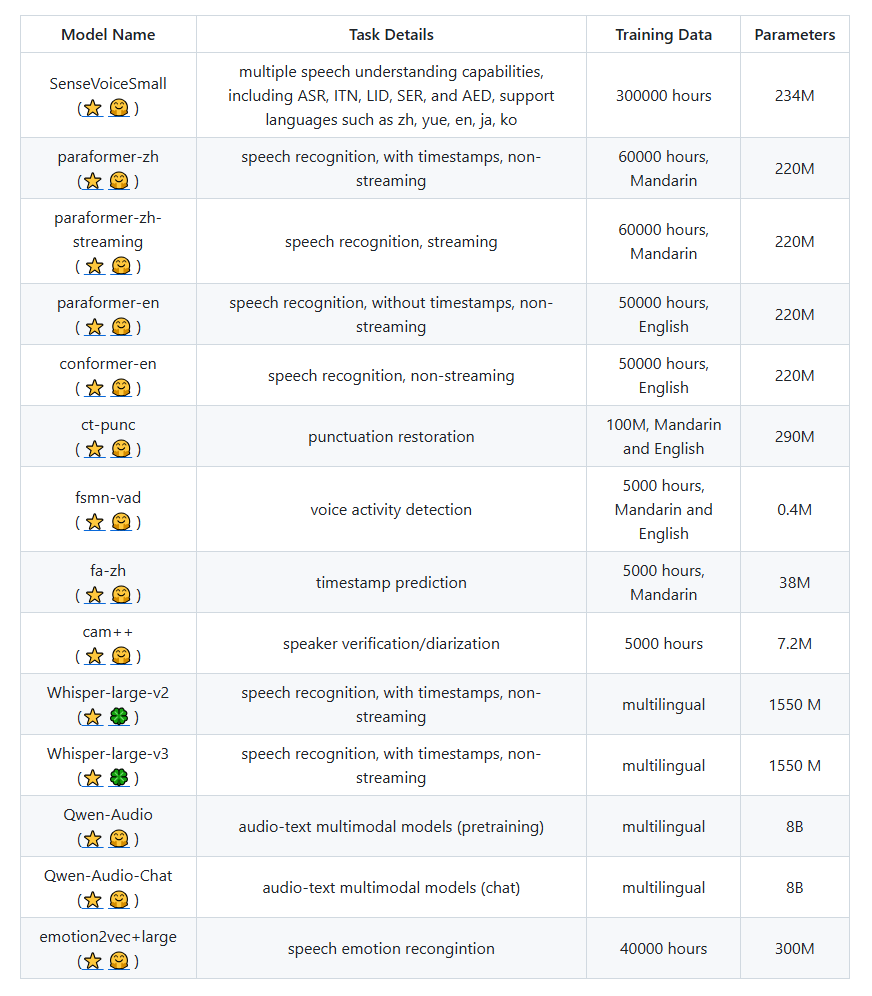

# Audio to text LLM

To convert the chinese audio to text there are several steps

## Step 1: Load and select the appropriate audio file format

 There are several audio files format, everyone has different advantages and disadvantages

### 1) WAV (Waveform Audio File Format):

Pros: High quality, uncompressed, widely supported.
Cons: Large file sizes, which can be cumbersome for storage and processing.
Best For: High-quality recordings where storage and processing power are less of a concern.

### 2) MP3 (MPEG Audio Layer III):

Pros: Compressed format, smaller file sizes, widely supported.
Cons: Lossy compression can affect audio quality, which might impact transcription accuracy.
Best For: Scenarios where file size is a major concern and some loss of quality is acceptable.

### 3) FLAC (Free Lossless Audio Codec):

Pros: Lossless compression (no loss of quality), smaller file sizes compared to WAV.
Cons: Larger file sizes than MP3, but still more manageable than WAV.
Best For: Balance between quality and file size, where maintaining high fidelity is important.

### 4) AAC (Advanced Audio Coding):

Pros: Better compression efficiency than MP3, generally provides better sound quality at the same bit rate.S
Cons: Lossy compression, but often with better results compared to MP3.
Best For: Scenarios where good quality and relatively small file sizes are needed.

## Steps 2: Choosing the Best LLM model for conervsion:

There are different Audio to Text conversion LLM models available, each of them have different sizes and complexity

For details visit the website: https://github.com/modelscope/FunASR

The most suitable models are 

### 1) SenseVoiceSmall: https://www.modelscope.cn/models/iic/SenseVoiceSmall

### 2) paraformer-zh: https://www.modelscope.cn/models/iic/speech_paraformer-large-vad-punc_asr_nat-zh-cn-16k-common-vocab8404-pytorch/summary

### 3) Whisper-large-v2: https://www.modelscope.cn/models/iic/speech_whisper-large_asr_multilingual/summary

Paraformer-zh is only trained on chinese language making it very suitable for chinese audio to text, while SensevoiceSmall is trained on four languages (English, Chinese, korean, japanese) making it more diverse.

Deatiled Functions and parameters details: https://github.com/modelscope/FunASR/blob/main/docs/tutorial/README.md